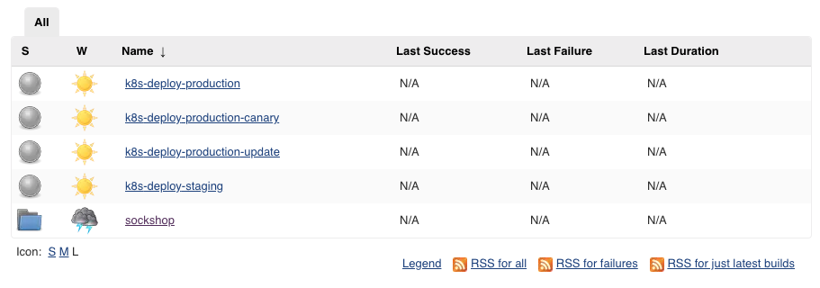
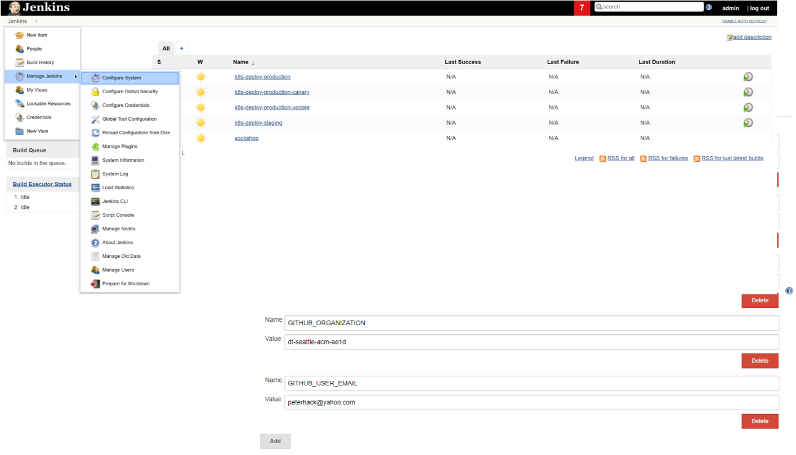
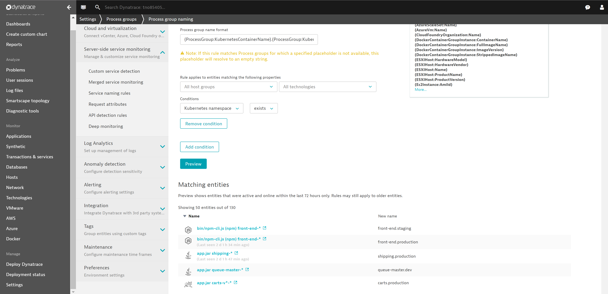
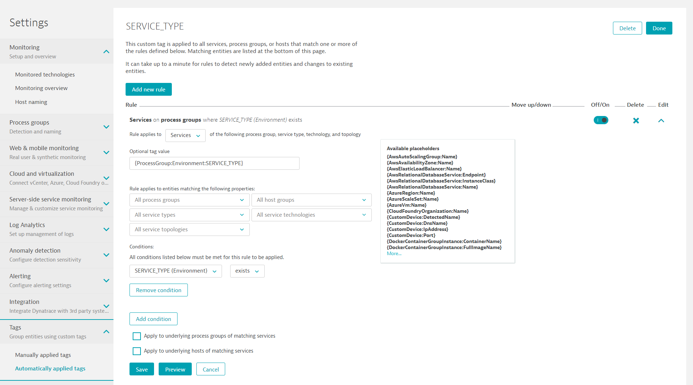

# Provision Dynatrace PERFORM HOTDAY 2019 Cluster on OpenShift

This repository contains all scripts and instructions needed to deploy the Continuous Performance in a Jenkins Pipeline on OpenShift (3.11).

## Prerequisites

Every attendee must have the following
* Laptop with a modern browser
* Laptop with SSH Client to remote into Bastian Host
* A GitHub Account

Every attendee will receive this information from the workshop instructors
* StudentID:    studentXY: This Student ID is used in your different host names
* Dynatrace:    Tenant ID, Tenant URL, username, password
* OpenShift:    OpenShift Cluster URL, username & password
* Bastian host: Hostname, username, pem & ppk file to remote into this machine
* Neotys:       Neoload Username

Together in the workshop, every attendee will create this
* A GitHub Organization to fork the Sockshop application to
* A GitHub Personal Access Token
* Automatically Deploy OneAgent, Sockshop and Jenkins on your OpenShift Cluster

## Preparation: Filling out our Cheat Sheet

In our workshop you will log into a "Bastion Host" that hosts a couple of setup scripts.
These scripts need values such as your Dynatrace Tenant, couple of tokens, your GitHub Organization & GitHub Token, ...
We already pre-propulated some of these values but you still need these:
```
DT Tenant URL:      https://ABC12345.sprint.dynatracelabs.com
OS Cluster URL:     https://master.studentXY.ocpworkshop.dtinnovationlabs.net
Bastion Host:       bastion.studentXY.ocpworkshop.dtinnovationlabs.net
GitHub Username:    yourgitusername
GitHub Token:       a56777199f8018f38360bc757ab778653bb54312d (your GitHub Token)
GitHub User email:  your@email.com
GitHub Org:         hotday2019contperfstudentXY
```

As we walk through the next steps please put these values in a text document - thats our cheat sheet :-)

### 1. GitHub Account
If you do not yet have a GitHub account please create one via [https://github.com/join]. 

**PUT your GitHub Username and Email into your text document!**

### 2. GitHub Organization
In your GitHub Account navigate to [https://github.com/organizations/new]. 
* For the name of your organization choose hotday2019contperfstudentXY where XY is replaced with your StudentID, e.g: hotday2019contperfstudent17
* For the billing email use the same email you used for signing up for GitHub. No worries - there won't be any costs and therefore no actual billing
* You can skip the steps "Invite members" & "Organization details"

**PUT the GitHub Organization Name in your text document**

### 3. GitHub Token
In your GitHub Account navigate to [https://github.com/settings/tokens]
* Click on "Generate new token"
* Confirm your account password
* Give the token the name: hotdaytoken
* Select the first group of checkboxes in the section "repo"
* Click on "Generate token"

**COPY that newly generated token value and paste it into your text document**

## Preparation: Access your Dynatrace Tenant and OpenShift Cluster

Let's validate that the Dynatrace Tenant and OpenShift Cluster we assigned to you are accessible

### 1. Login to Dynatrace Tenant

Browser to your <DT Tenant URL> and login with the username & password provided! This shoudl be a clean fresh tenant with no agents installed!

### 2. Login to OpenShift

Browser to your <OS Cluster URL> and login with the OpenShift username & password provided! You shoudl be able to login and see currently installed projects!

## Preparation: Connecting & Configuring the Bastian Host
Every student has a "bastion host" which is a Linux machine that has all required tools and software installed to deploy our sample application on OpenShift installation, e.g: oc, git, hub, js, ...

### 1. Connect to your Bastian Host

Make sure you have your <Bastion Host> hostname ready. The bastion host is a Linux machine on EC2 which means the default user is ec2-user. 
Here are some examples to connect (make sure you use your <Bastion Host> host name)

**Using SSH:**

    ```
    $ ssh -i hotday.pem ec2-user@bastian.studentXY.ocpworkshop.dtinnovationlabs.net
    ```

**Using WSU (Windows Subsystem for Linux)**
In your Windows Console type: wsl
Now you have a full Linux bash. Navigate to the directory where you have stored the .pem file and execute this:

    ```
    $ ssh -i hotday.pem ec2-user@bastian.studentXY.ocpworkshop.dtinnovationlabs.net
    ```

**Using Putty (on Windows)**
Ask your instructor for a hotday.ppk file. Now you can use Puttygen and connect to your Bastian Host
1. Navigate to Connection -> SSH -> Auth and there browse for the .ppk file
2. Navigate to Session and enter ec2-user@bastian.studentXY.ocpworkshop.dtinnovationlabs.net
3. Click on Open

### 2. Validate Initial Setup
Once you are connected to your bastian host we want to validate if we have prepared it correctly. Lets validate that the home directory of your ec2-user has the following directory: hotday2019_contperf_openshift. Simply execute an ls-l
```
$ ls -l
```

If you dont see that directory lets just pull it down from git by executing the following command
```
git clone https://github.com/grabnerandi/hotday2019_openshift
```

### 3. Clone the Workshop Setup GitHub Repo
Still on the command line we are going to clone this current GitHub repo into your bastian host home directory. Execute the following in your command line:

    ```
    $ github clone https://github.com/grabnerandi/hotday2019_contperf_openshift
    ```


## Preparation: Fork SockShop into your GitHub Organization

Execute the `~/forkGitHubRepositories.sh` script in your home directory. This script takes the name of the GitHub organization you have created earlier:

    ```
    $ ./scripts/forkGitHubRepositories.sh <GitHubOrg>
    ```

    This script `clone`s all needed repositories and the uses the `hub` command ([hub](https://hub.github.com/)) to fork those repositories to the passed GitHub organization. After that, the script deletes all repositories and `clone`s them again from the new URL.

## Preparation: Deploy to OpenShift & Verify

### 1. Insert information in ./scripts/creds.json by executing *./scripts/creds.sh*
This script will prompt you for all information needed to complete the setup, and populate the file *scripts/creds.json* with them. (If for some reason there are problems with this script, you can of course also directly enter the values into creds.json):

    ```
    $ ./scripts/creds.sh
    ```
    
### 2. Execute *./scripts/setup-infrastructure.sh*
This will deploy a Jenkins service within your OpenShift Cluster, as well as an initial deployment of the sockshop application in the *dev*, *staging* and *production* namespaces. NOTE: If you use a Mac, you can use the script *setup-infrastructure-macos.sh*.
*Note that the script will run for some time (~5 mins), since it will wait for Jenkins to boot and set up some credentials via the Jenkins REST API.*:

    ```
    $ ./scripts/setup-infrastructure.sh
    ```
    
### 3. Login to Jenkins
Afterwards, you can login using the default Jenkins credentials (admin/AiTx4u8VyUV8tCKk). It's recommended to change these credentials right after the first login. You can get the URL of Jenkins by executing:

    ```
    $ oc get route jenkins -n cicd
    ```

### 4. Verify the installation
In the Jenkins dashboard, you should see the following pipelines:

* k8s-deploy-production
* k8s-deploy-production-canary
* k8s-deploy-production-update
* k8s-deploy-staging
* A folder called *sockshop*



Further, navigate to Jenkins > Manage Jenkins > Configure System, and see if the Environment Variables used by the build pipelines have been set correctly (Note that the value for the parameter *DT_TENANT_URL* should start with 'https://'):



### 5. Verify your deployment of the Sockshop service
Execute the following commands to retrieve the URLs of your front-end in the dev, staging and production environments:

```
$ oc get route front-end -n dev
``` 
```
$ oc get route front-end -n staging
``` 
```
$ oc get route front-end -n production
``` 

## Setup Tagging of Services and Naming of Process Groups in Dynatrace

This allows you to query service-level metrics (e.g.: Response Time, Failure Rate, or Throughput) automatically based on meta-data that you have passed during a deployment, e.g.: *Service Type* (frontend, backend), *Deployment Stage* (dev, staging, production). Besides, this lab creates tagging rules based on Kubernetes namespace and Pod name.

In order to tag services, Dynatrace provides **Automated Service Tag Rules**. In this lab you want Dynatrace to create a new service-level tag with the name **SERVICE_TYPE**. It should only apply the tag *if* the underlying Process Group has the custom meta-data property **SERVICE_TYPE**. If that is the case, you also want to take this value and apply it as the tag value for **Service_Type**.

### Step 1: Create a Naming Rule for Process Groups
1. Go to **Settings**, **Process groups**, and click on **Process group naming**.
1. Create a new process group naming rule with **Add new rule**. 
1. Edit that rule:
    * Rule name: `Container.Namespace`
    * Process group name format: `{ProcessGroup:KubernetesContainerName}.{ProcessGroup:KubernetesNamespace}`
    * Condition: `Kubernetes namespace`> `exits`
1. Click on **Preview** and **Save**.

Screenshot shows this rule definition.


### Step 2: Create Service Tag Rule
1. Go to **Settings**, **Tags**, and click on **Automatically applied tags**.
1. Create a new custom tag with the name `SERVICE_TYPE`.
1. Edit that tag and **Add new rule**.
    * Rule applies to: `Services` 
    * Optional tag value: `{ProcessGroup:Environment:SERVICE_TYPE}`
    * Condition on `Process group properties -> SERVICE_TYPE` if `exists`
1. Click on **Preview** to validate rule works.
1. Click on **Save** for the rule and then **Done**.

Screenshot shows this rule definition.


### Step 3: Search for Services by Tag
It will take about 30 seconds until the tags are automatically applied to the services.
1. Go to **Transaction & services**.
1. Click in **Filtered by** edit field.
1. Select `SERVICE_TYPE` and select `FRONTEND`.
1. You should see the service `front-end`. Open it up.

### Step 4: Create Service Tag for App Name based on K8S Container Name
1. Go to **Settings**, **Tags**, and click on **Automatically applied tags**.
1. Create a new custom tag with the name `app`.
1. Edit that tag and **Add new rule**.
    * Rule applies to: `Services` 
    * Optional tag value: `{ProcessGroup:KubernetesContainerName}`
    * Condition on `Kubernetes container name` if `exists`
1. Click on **Preview** to validate rule works.
1. Click on **Save** for the rule and then **Done**.

### Step 5: Create Service Tag for Environment based on K8S Namespace
1. Go to **Settings**, **Tags**, and click on **Automatically applied tags**.
1. Create a new custom tag with the name `environment`.
1. Edit that tag and **Add new rule**.
    * Rule applies to: `Services` 
    * Optional tag value: `{ProcessGroup:KubernetesNamespace}`
    * Condition on `Kubernetes namespace` if `exists`
1. Click on **Preview** to validate rule works.
1. Click on **Save** for the rule and then **Done**.

## Updating your sockshop services:

* To deploy updates you made to your services to the development environment, you can follow the instructions at this location: (Deploy to dev)[https://github.com/dynatrace-innovationlab/acl-docs/tree/master/workshop/05_Developing_Microservices/02_Deploy_Microservice_to_Dev].

* To deploy your changes to the staging environment, please refer to the instructions at this location: (Deploy to Staging)[https://github.com/dynatrace-innovationlab/acl-docs/tree/master/workshop/05_Developing_Microservices/03_Deploy_Microservice_to_Staging].


