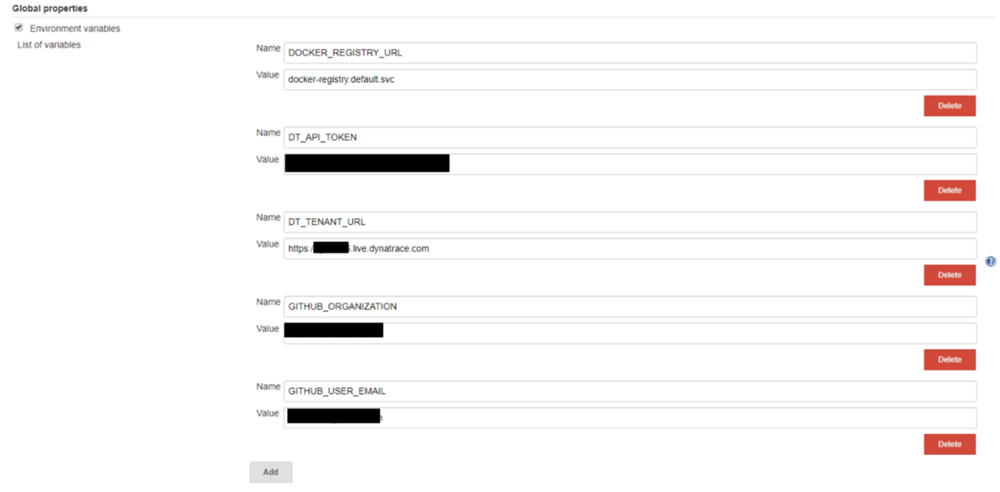

# Provision ACM Workshop Cluster on OpenShift

This repository contains all scripts and instructions needed to deploy the ACM Sockshop demo to OpenShift (3.11).
## Prerequisites:

* jq (https://stedolan.github.io/jq/) has to be installed to run the setup script.
* A GitHub Organization to fork the Sockshop application to
* A GitHub Personal Access Token
* OpenShift command line util (oc), and logged in to your cluster
* Git CLI & [Hub CLI](https://hub.github.com/)
* A Dynatrace Tenant - you will need the Dynatrace Tenant ID, a Dynatrace API Token and Dynatrace PaaS Token to complete the setup.

## Instructions:
1. Deploy the Dynattrace OneAgent Operator, as described in https://github.com/Dynatrace/dynatrace-oneagent-operator
1. Execute the `~/forkGitHubRepositories.sh` script in your home directory. This script takes the name of the GitHub organization you have created earlier.

    ```
    $ ./scripts/forkGitHubRepositories.sh <GitHubOrg>
    ```

    This script `clone`s all needed repositories and the uses the `hub` command ([hub](https://hub.github.com/)) to fork those repositories to the passed GitHub organization. After that, the script deletes all repositories and `clone`s them again from the new URL.
    
1. Insert information in ./scripts/creds.json by executing *./scripts/creds.sh* - This script will prompt you for all information needed to complete the setup, and populate the file *scripts/creds.json* with them.


    ```
    $ ./scripts/creds.sh
    ```
    
1. Execute *./scripts/createJenkins.sh* - This will deploy a Jenkins service within your OpenShift Cluster, as well as an initial deployment of the sockshop application in the *dev*, *staging* and *production* namespaces. 
*Note that the script will run for some time (~5 mins), since it will wait for Jenkins to boot and set up some credentials via the Jenkins REST API.*


    ```
    $ ./scripts/createJenkins.sh
    ```
    
1. Afterwards, you can login using the default Jenkins credentials (admin/admin). It's recommended to change these credentials right after the first login. You can get the URL of Jenkins by executing

```
$ oc get route jenkins -n cicd
``` 

1. Verify the installation: In the Jenkins dashboard, you should see the following pipelines:

* k8s-deploy-production
* k8s-deploy-production-canary
* k8s-deploy-production-update
* k8s-deploy-staging
* A folder called *sockshop*


Further, navigate to Jenkins > Manage Jenkins > Configure System, and see if the Environment Variables used by the build pipelines have been set correctly:



Manual configuration step in Jenkins: Configure the Performance Signature Plugin (add the Dynatrace Server + API Token).

